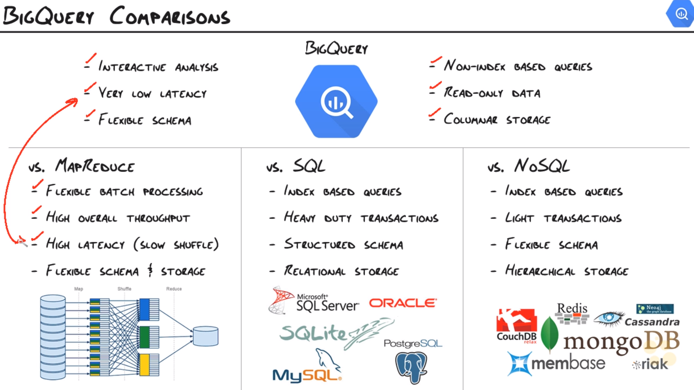

# BigQuery Internals

- BigQuery Storage & Query
- BigQuery Architecture
- BigQuery Comparisons

## BigQuery Storage & Query

Record storage stores the entire record as a single unit on disk.
BQ uses columnar storage - breaks the record up into column values and spreads the column values across disk. So if we use a query which only queries one column, only that column record will be read from disk. This minimises disk traffic and disk i/o. Record storage has a compression ratio of 1:3 whereas columnar storage has a compression ratio of 1:10. But columnar storage is not so good when it comes to updating records.

Dremel uses a hierarchical serving tree - a massively parallel distributed tree that pushes queries down and quickly aggregates results. This gives extremely efficient execution of queries, because queries can be executed in parallel across machines.

## BigQuery Architecture

#### Querying process

1. What columns do I need to pull from storage? (e.g. state and year)
2. Leaf nodes are spun up (by Dremel) to work on the query - running local aggregations of data, filtering out anything that it doesn't need. 
3. Intermediate mixers - bring the data from the distributed machines together into fewer machines.
4. Root mixer - brings everything back together as one and delivers to the client.

Only use EACH if you have a large number of distinct values.

## BigQuery Comparisons

- BigQuery is great for analysis.
- MapReduce is great for processing.
- SQL / NoSQL are great for OLTP.
