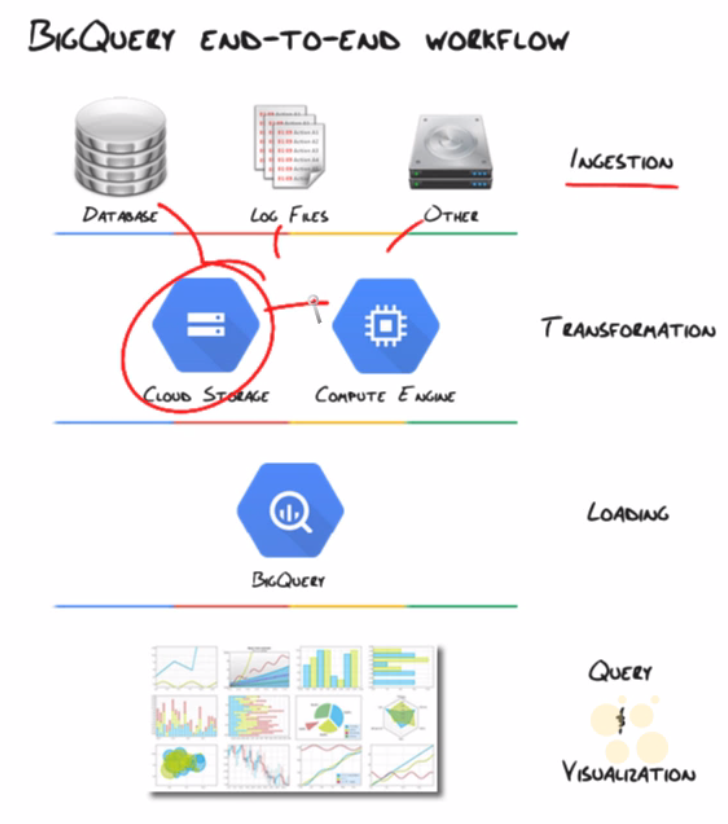

## BigQuery Basics video

### Video Outline

- BigQuery Use Case
- BigQuery Pipeline to analysis
- BigQuery Fundamentals
- Accessing BigQuery

### BigQuery Use Case: Safari Books.

Safari Books online. Have billions of records of usage data. 
[More information here.](http://cbt.gg/1o0xM0e)

#### Goals / benefits 

1. Business dashboards & trend analysis.
2. Sales intelligence & automatic lead generation. e.g. matching user browsing history to transactions 
3. Fast ad-hoc answers for specific business questions.

#### Challenges

1. Existing MySQL infrastructure too slow.
2. Hadoop required too many resources to maintain.

### Pipeline to analysis

1. Data in CRM, RDBMS, Log files, etc.
2. Use ETL tools to transform data
3. Get data into Google Cloud storage.
	- Use object change notification - as soon as files in cloud storage update, BigQuery can automatically pull them in.
4. [Optional] Use Hadoop or MapReduce to run additional transformation steps.
5. Send data over to BigQuery. 
6. Use Google Data visualisation tools OR 
7. Use 3rd party data visualisation e.g. Tableau.

**BigQuery end to end workflow**

### BigQuery fundamentals

- Project: Container for users, APIs, authentication & billing
- Dataset: a container for tables. Lowest level for applying access control.
- Table: the data containers
	- Schemas: every table has one. Defined on creation. Each one has:
		- Name (field name)
		- Type (data type: string, float, integer, etc.)
		- Mode: nullable, required, repeated.
- Column ... of a table.

#### Data formats

- CSV
- JSON

### Accessing BigQuery

- BigQuery interactive web UI. Great management / development tool.
- Command line tool (BQ). Python tool. Allows us to do everything in the web UI tool and more. We can create scripts to automate the commmon management stuff.
- [REST API:](http://developers.google.com/apis-explorer) build applications & tools which hit BigQuery through the REST API. 
- 3rd party tools: visualisation tools (e.g. [BIME](http://www.bimeanalytics.com/)), loading tools, direct connect tools.

[<--Back](README.md)