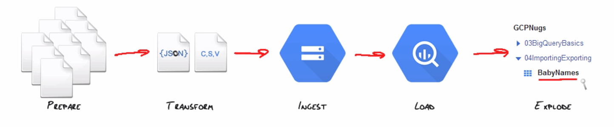

# Importing and exporting data

## Data Formats
Complex data / fast reading required: JSON
Flat data: CSV

CSV options
- skipLeadingrows
- AllowQuoted / Viewlines
fieldDelimiter, allowJaggedRows

#### Data compression
Choose compressed for more storage but slower speeds. Uncompressed for faster speeds but less available storage.

#### Denormalisation
Denormalise your data structure at the source. Flatten / join your data, so querying will be much faster then with joined tables.

#### Transformation
Convert existing formats to CSV/JSON.
Relational format to:
	- Flat (normalised), i.e. CSV
	- Hybrid (Nested / repeated), i.e. JSON

If converting XML to required formats - DOM-based parsers are really slow. 

## Loading BigQuery

#### Load types
- Bulk load via job
	- Limit: 1,000 loads per table per day, 10,000 loads per project, per day.
	- Max size per load job: 1 TB
	- Max files per load job: 10,000
- Stream records individually
	- Max row size = 20KB
	- Max data size of all rows = 1MB
	- Max rows / s = 10,000
- Create, append or overwrite tables

#### Loading methods
- Google Cloud storage (read access required to given bucket)
- Send a POST request
- App Engine Datastore & GCS logs

#### Loading challenges & solutions
##### Challenges
- Keeping costs down
- Picking correct frequency of upload

##### Solutions
- Consolidate data at source = less jobs. Then explode data in BQ.
- Aggregation - depends on data & query patterns.
- Cost: shard (/partition) data across multiple tables by time.
	- e.g. break tables into new tables based on dimensions - such as year, state. If you use one big table, you're charged on how much data is processed. If you can limit the quota of data which is processed, you can avoid massive charges. Storage is cheap - querying is where the charges rack up. So if you break data out into specific tables, you limit the proessing.
	- Useful tools to help with this include table joins and table wildcard - covered late.

##### Best practices
- Split large files if necessary / consolidate small files into one if frequency is high.
- Storage is cheaper than processing
- Upload to GCS.

## Exporting data
- Choose format
- Choose compression (gzip or none)
- Make sure you have write access to GCS bucket if needed.

##### Export tools
- Web UI
- BQ CLI using extract command
- BQ API

##### Quotas
- 1,000 exports / day
- 1GB data / file
- 500 wildcard URIs / export