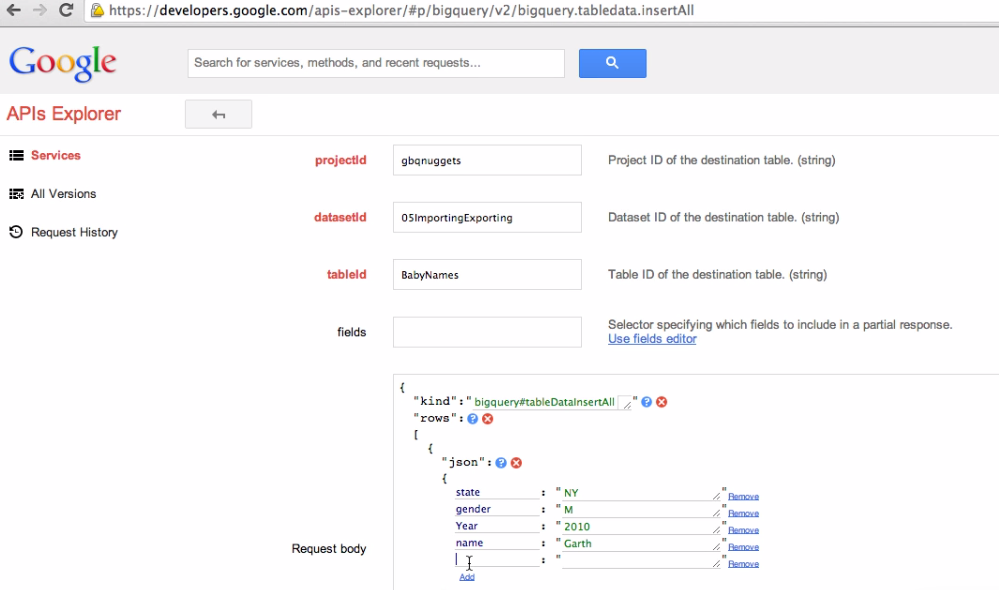
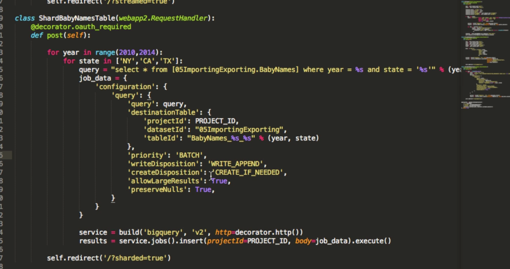

## Importing and exporting demo

#### Contents
- Bulk loads
- Streaming inserts
- Sharding data
- Exporting data

#### Example - dumps.wikimedia.org

##### Download the file
Download the file through the CL `curl -O http://dumps.wikimedia.org/other/pagecounts-row/etc...`

Once downloaded - you can send to GCS or load from the filesystem using the BQ CLI.

```
gcloud auth list # to make sure logged in
gcloud auth login
```

##### Load the data

```
bq load --F " " --quote "" O5ImportingExporting *.gz language,title,requests:integer,content_size:integer
```

above: 
- `bq load` loading command
- -`F` field delimiter
- `"  -- quote` sets the quote characters
- `05ImportingExporting` the destination table URI in GCS
- `*.gz` the file URI to upload, using wildcard for convenience.
- `language, title, etc` - schema for the data. We didn't specify for strings as that is the default data type.

Once all the above are filled out, execute the command and your upload will begin. Navigate to BigQuery to start querying the data.

#### Streaming data

**Navigate to the Google apis explorer**

https://developers.google.com/apis-explorer/#p/bigquery/v2/
Use this to get an idea of how your JSON should be structured. Use streaming to add new records ad-hoc.

Scroll down to `bigquery.tabledata.insertAll`
Check the format of your JSON using this tool, to make sure it will work OK with the API.
Request Body: kind: tabledatainsert all
Then move to JSON, then rows - and enter in your schema for your rows.
Execute the query and check the response you get, to make sure there are no errors, and that your JSON is correctly structured / formatted. This tool will also add data to your table if that's what you choose to do.



#### Sharding data in BQ

A great way of splitting data to limit the number of rows queried. You could do this manually if the datasets are relatively simple, but programatically if you have a lot of moving parts.
e.g. in Python, set a couple of nested for loops to split your master data tables by year and country, writing back to new tables in GCS using the year and country as identifiers.



#### Exporting data

##### From the web UI

1. Navigate to your table in the BQ menu
2. Use the drop-down arrow next to the table name
3. Choose export
4. Choose output format
5. Choose compression yes no
6. Choose the destination location (e.g. GCS URI)

##### From the CLI

```
bq extract --destination_format = NEWLINE_DELIMITED_JSON 
05ImportingExporting.BabyNames_2010_NY gs://gbqnugdata/babynames_2010_ny*.JSON
```

- `bq extract` = the command
- `--destination_format` = selecting the desired output format
- `05ImportingExporting` = URI for the table to extract
- `gs://gbqnugdata/babynames_2010_ny*.JSON` = destination URI in GCS

With the * at the end - if the data export was > 1GB, the operation will split the extract into multiple files.
Go back to your bucket and you should see the file there.