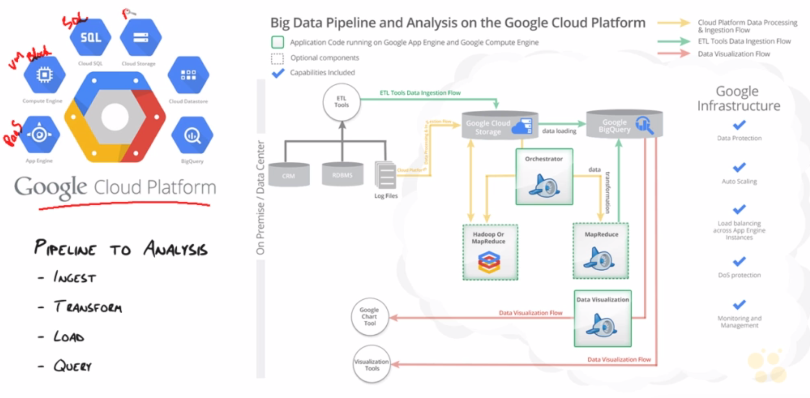

## Introduction video

### Video Outline

- Google & big data
- Bigquery overview
- Bigquery big picture

## Google and big data

Big data challenges

- Scaling up is expensive
- Scaling up is error prone
- Scaling up has limitations
- Traditional methods didn't cut it. 

Google wanted to be self reliant, so they scaled out. Bought a fleet of commodity machines so failure was the norm.

3 core technologies. Google's big data stack 1.0

1. Google File System (GFS). Core concept = fail all the time. Replicate data across the cluster so failure isn't a problem.
2. MapReduce. Slow & difficult - needs a lot of skills.
3. BigTable - sits on top of GFS. A key-value store (key being the URL, value being all the information). BigTable sits underneath a lot of Google products out there. Problems come up in multi-centre environment.

BigTable is the grandfather of NoSQL - MongoDB, etc.

Due to the problems with Google's big data stack 1.0, they built out new technologies.

**Google's cloud pipeline**

1. Megastore - strong consistency on top of BigTable. If data goes through megastore to get into BigTable, it has to be hardened, committed to get in there.
2. Spanner - "the next iteration of megastore". Does everything Megastore does, but on a planet-wide scale. Google installed GPS and atomic clocks in every data centre, to fix timing issues.
3. Dremel - Came about because Google Engineers had a hard time getting answers using MapReduce. Engineers wanted a SQL-like interface to get quick answers from their data centres.
4. Colossus - not a lot know at this stage as it's a new technology. This is GFS version 2. Has all but replaced GFS.

Stack 1: all about batch processing.
Stack 2: all about real-time processing.

#### What is BigQuery?

BigQuery is the public implementation of Dremel.
Fully-managed data analysis service for large datasets.
Reliable, secure, scalable, friendly and extremely fast.
Uses a multi-level execution tree to dispatch queries and aggregate results across 1000s of machines.

#### Why use it?

- Fast, cheap interaction with big data.
- Generating big data reports requires skilled people. Anyone with SQL can use it.
- BigQuery redefines big data analytics. Importing, exporting and shaping data is simplified.

#### BigQuery Vs MapReduce
MapReduce is at the start of the pipeline, transforming the data. Batch processing.
BigQuery is for near real-time analytics.

#### End-to-end workflow
Data goes into Cloud Storage - imported from database / log files / other. Computed in Transformed into meaningful format using MapReduce / compute engine into a format BigQuery can understand.

BigQuery provides a user-friendly front end to access this data.

biquery-samples - a ton of example datasets.

[<--Back](README.md)