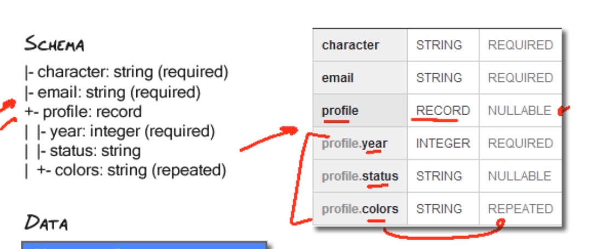
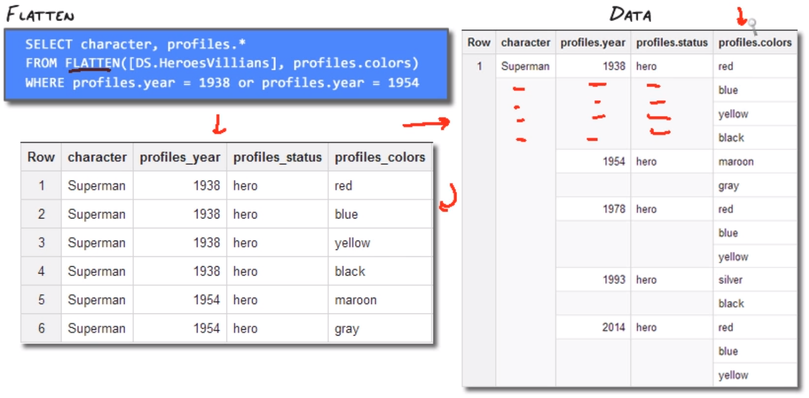

# Advanced Querying

#### Contents

- Working with large datasets
- Repeated & nested data
- Flatten & within clauses
- Advanced Functions

## Working with large datasets

#### Join Each & Group each by

These functions do not exist in SQL. Standard joins required the right-side table to contain less than 8MB of data.
Join each enables large table joins with a performance penalty.

##### Rules of thumb
- Use when the number of distinct records is large.
- Use join & group by when performance is key.
- Keep your big tables on the left side of the join.

Large results: query results are limited to 128MB by default. Check 'allow large results' in the web UI / set `--allow large results` in CLI, set `allowLargeResults` in API.

#### Table decorators
Help drive down cost & improve performance. Every time you run a query - BQ has to scan the entire dataset. Table decorators help you create a subset base on a period of time:

- Snapshop decorators. `SELECT * FROM <table>@-360000` minus means relative to the current time, in milliseconds. @0 would give you the oldest possible snapshot of the table data.
`@<table>-360000--1800000` sets a range of data to look within.

#### Table wildcard functions

**TABLE_DATE_RANGE**
- Use to query data from a set of tables. In order for this to work, you need to name your tables `<prefix>YYYYddmm`
Table_date_range 
- Syntax: `TABLE_DATE_RANGE(prefix, time1, time2)` where prefix = dataset.table

**TABLE_QUERY**
`TABLE_QUERY(dataset, expr)`
e.g. 

```sql
SELECT .. FROM (TABLE_QUERY(Dataset, 'table_id CONTAINS "new" AND length(table_id = 3')
```

## Repeated & nested data

Used to store lists within a record, only supported by JSON. Attribute mode = "REPEATED".
When querying repeated values. 
- Querying for single conditions are fine (e.g. colours = red)
- Querying for multiple conditions is tougher. e.g. if a list contains red & yellow, querying for colours = red & yellow will be false.

To get around this, you need to run a sub-select.
- Run first select with condition 1.
- Run a second select & join based on condition 2.

e.g.

```sql
SELECT hv1.character FROM [DS.heroesvillains] hv1
JOIN (SELECT character from [ds.heroesvillains] where colours = 'red')
hv2 on hv1.character = hv2.character
WHERE hv1.colors = 'yellow'
```


#### Nested data

To nest data - the parent node type needs to be a RECORD.


Example JSON to set this schema:

```JSON
[{"name": "character", "type": "string", "mode": "required"},
{"name":"email","type": "string", "mode": "required"}
{"name":"profile","type": "RECORD", "mode": "nullable", "fields":
	[{"name":"year","type": "integer", "mode": "required"},
	{"name":"status","type": "string", "mode": "nullable"},
	{"name":"colors","type": "string", "mode": "repeated"}]}]
```

#### Nested & repeated

- Used to store records within a record
- Set type to record & mode to repeated

e.g.:

```JSON
[{"name": "profiles", "type": "RECORD", "mode": REPEATED", "fields": 
[{ <fields here> } ] }]
```

## Flatten & within clauses

#### Flatten

When you have repeated data, bigquery will automatically flatten it out - i.e. fill in row values for any data which is nested / repeated.
You need to explicitly call flatten when your data contains multiple repeated fields. 

```sql
SELECT character, profiles.*
FROM FLATTEN(DS.HeroesVillains], profiles.colors)
WHERE profiles.year = 1938 or profiles.year = 1954
```



#### Within

Allows us to do scoped aggregation over data.

- Within record: targets entire record
	- e.g. 

	```sql
	SELECT character, COUNT(profiles.colors) 
	WITHIN RECORD AS numColors FROM [DS.HeroesVillains]
	WHERE profiles.year >= 1978
	```

- Within node: targets a field or portion of the data
	- e.g.

	```sql
		SELECT character, COUNT(profiles.colors) 
		WITHIN profiles AS colors 
		FROM [DS.HeroesVillains]
		WHERE profiles.year >= 1993
		```

## Advanced Functions

#### JSON functions

- Store & search JSON data.
- More flexible than declaring fields.
- Can lead to higher costs.

JSON_EXTRACT(json, json_path): returns JSON formatted data
`JSON_EXTRACT(json, '$.colors') as data`

JSON_EXTRACT_SCALAR(json, json_path): returns actual values.
`JSON_EXTRACT_SCALAR(json, '$.colors[1]')`

#### Regex functions

- Use "contains" for simple matching - faster computation.

REGEXP_MATCH(str, reg_exp): allows you to search strings based on a regex.
REGEXP_REPLACE(): replace string values.

#### Window functions

Perform aggregates on partitions of data.

Syntax: `WINDOW_FUNCTION() OVER ([ PARTITION BY <expr> ]) [ORDER BY <expr> ]`

e.g.

#### Most popular words in Shakespeare

```sql
SELECT * FROM (
	select
    word,
    word_count,
    corpus,
    RANK() OVER (ORDER BY word_count DESC) as rank,
    from
      [publicdata:samples.shakespeare]    
)
HAVING rank <= 5
```

#### Most popular words in Shakespeare by corpus

```sql
SELECT * FROM (
	select
    word,
    word_count,
    corpus,
    RANK() OVER (PARTITION BY corpus ORDER BY word_count DESC) as rank,
    from
      [publicdata:samples.shakespeare]    
)
HAVING rank <= 5
```